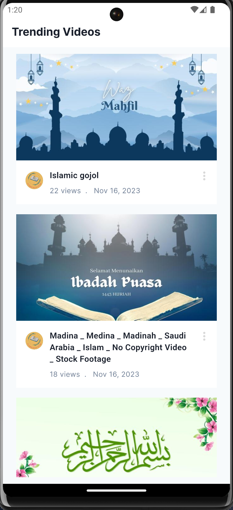
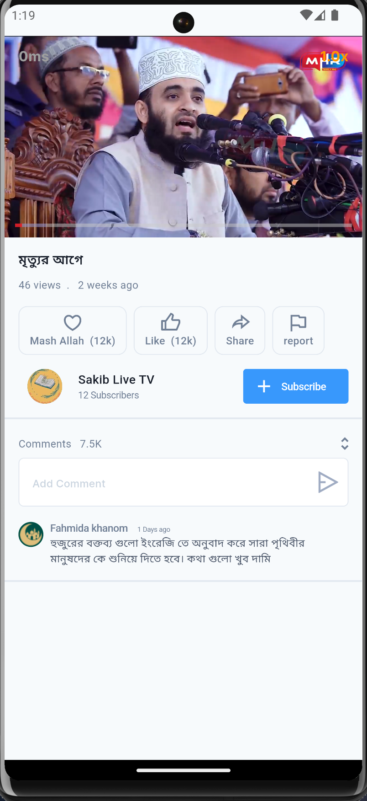

# clientproject

This is video player app
where you play trending video

## Getting Started

This project is developed using Flutter, adhering to the MVVM architecture pattern.
For state management, I have utilized the GetX library, providing a robust and efficient solution.
In future iterations, I plan to incorporate the Bloc pattern for enhanced state management capabilities.
Attached below are some project screenshots for your reference.

For help getting started with Flutter development, view the
[online documentation](https://docs.flutter.dev/), which offers tutorials,
samples, guidance on mobile development, and a full API reference.
